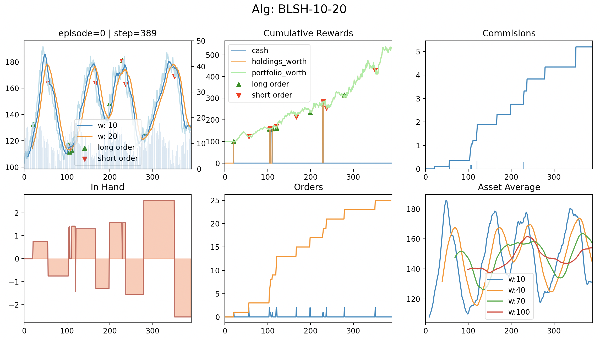

# Stocks Simulator (Streamlit + Matplotlib)

## Simulators API

### Usage:

```python
def main():
    episodes = 1
    env = SomeEnv(to_plot=True, list_of_assets=stocks_names_list)
    observation, info = env.reset()
    main_asset = 'SPY'
    for episode in range(episodes):
        for step in range(env.max_steps):
            print(f'\r{episode=} | {step=}', end='')
            action = env.sample_action(main_asset)
            env.step(action)
            if step % 200 == 0 or step == env.max_steps - 1:
                env.render(info={'episode': episode,
                                 'step': step, 'main_asset': main_asset})

    plt.show()
```
## Algorithms API

### Need To Implement:

```python
from algs.alg_meta_class import MetaAlg

class SomeAlg(MetaAlg):

    def __init__(self, env, to_plot=False, params=None):
        super().__init__(env, to_plot, params)
        # init
        # <yout init>
        self.name = f'<give a name>'

    def return_action(self, observation):
        # <calculate something>
        # <...>
        # return list of actions
        return [(self.main_asset, 0), (self.main_asset, -1)]

    def update_after_action(self, observation, action, portfolio_worth, next_observation, terminated, truncated):
        # <do something after taking an action>
        pass
```

### Usage:

```python
def main():
    episodes = 1
    w1, w2 = 10, 20
    # env = SinStockEnv(risk_rate=1)
    env = SomeEnv(list_of_assets=stocks_names_list)
    alg = SomeAlg(env=env, to_plot=True, params={...})
    observation, info = env.reset()
    alg.reset()
    for episode in range(episodes):
        for step in range(env.max_steps):
            print(f'\r{episode=} | {step=}', end='')
            action = alg.return_action(observation)
            next_observation, portfolio_worth, terminated, truncated, info = env.step(action)
            alg.update_after_action(observation, action, portfolio_worth, next_observation, terminated)
            observation = next_observation
            if step % 200 == 0 or step == env.max_steps - 1:
                # env.render(info={'episode': episode, 'step': step, 'alg_name': alg.name})
                alg.render(info={'episode': episode, 'step': step, 'w1': w1, 'w2': w2})

    plt.show()
```

## Screenshots from the Simulator

### BLSH Strategy:



### Episodic Semi-gradient Sarsa for Estimating $q = q*$


## Credits

- [GitHub (self) | Gym Env For Stock Trading](https://github.com/Arseni1919/gym-stocktrading)
- [GitHub (self) | gather game](https://github.com/Arseni1919/Gather_Game/blob/main/impl_env_gather.py)
- [GitHub (self) | NN with stocks](https://github.com/Arseni1919/Implementing_NN_Stocks)
- [GitHub (Kirill) | backtester](https://github.com/kirilgravis/NTC/blob/main/Analysys/Three_days.ipynb)
- [GitHub | NTC](https://github.com/kirilgravis/NTC)

- [mpl | markers](https://matplotlib.org/stable/api/markers_api.html)
- [blog | How to build a real-time live dashboard with Streamlit](https://blog.streamlit.io/how-to-build-a-real-time-live-dashboard-with-streamlit/)
- [YouTube | How to Deploy Your App to Streamlit Community Cloud](https://www.youtube.com/watch?v=HKoOBiAaHGg&t=44s&ab_channel=Streamlit)
- [google | finance](https://www.google.com/finance/quote/.INX:INDEXSP)

### [Plotly](https://plotly.com/python/)

- [plotly | time series graphs](https://plotly.com/python/time-series/)
- [plotly | subplots](https://plotly.com/python/subplots/)

### [StreamLit](https://docs.streamlit.io/library/api-reference)

- [st | home](https://share.streamlit.io/)
- [st | API](https://docs.streamlit.io/library/api-reference)
- [st | secrets](https://docs.streamlit.io/streamlit-cloud/get-started/deploy-an-app/connect-to-data-sources/secrets-management)
- [st | session state](https://docs.streamlit.io/library/api-reference/session-state)

### [Alpaca](https://alpaca.markets/docs/market-data/)

- [alpaca | market data API](https://alpaca.markets/docs/market-data/)
- [alpaca | Trading Account](https://alpaca.markets/docs/api-references/trading-api/account/)
- [alpaca | get market data](https://alpaca.markets/docs/market-data/getting-started/)
- [tds | how to use alpaca](https://medium.com/@chris_42047/getting-started-with-the-alpaca-trading-apis-python-tutorial-226f4dca5d8a)