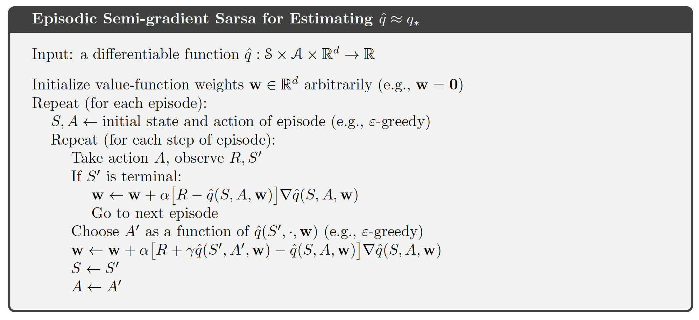

# Stocks Simulator (version 1)

## Algorithms

### Episodic Semi-gradient Sarsa for Estimating $q = q*$

## Credits

- [github (self) | Gym Env For Stock Trading](https://github.com/Arseni1919/gym-stocktrading)
- [github (self) | gather game](https://github.com/Arseni1919/Gather_Game/blob/main/impl_env_gather.py)
- [github (self) | NN with stocks](https://github.com/Arseni1919/Implementing_NN_Stocks)
- [mpl | markers](https://matplotlib.org/stable/api/markers_api.html)
- 